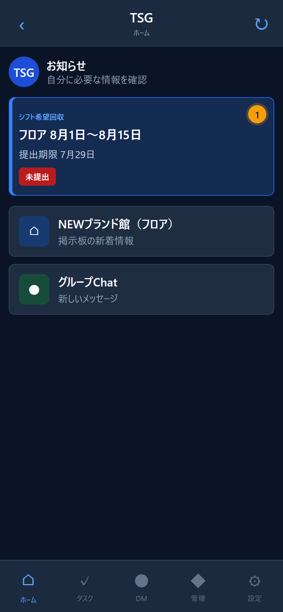
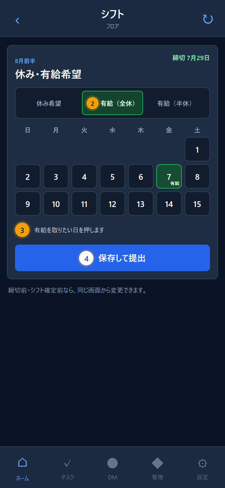
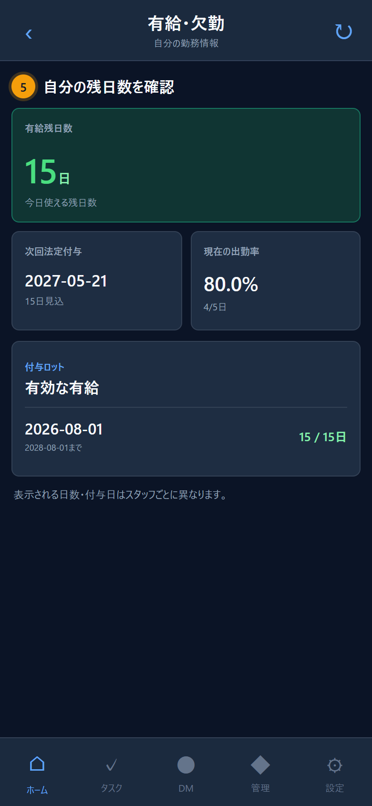

# TSG有給管理システム 運用案内

運用開始: 2026年8月1日  
対象: 株式会社テクニカルスタッフ 全スタッフ

有給の残日数・付与予定・取得履歴をTSGで確認できます。  
予定して取る有給はシフト希望回収と一緒に提出し、希望回収後や急な有給は「管理」から申請します。

## 予定して有給を取るとき

1. ホーム上部の「シフト希望回収」を開く
2. 「希望提出」を開く
3. 「有給（全休）」または「有給（半休）」を選ぶ
4. 有給を取りたい日を押す
5. 「保存して提出」を押す

提出期限を過ぎても、シフト確定前は同じ画面から有給（全休・半休）だけ変更できます。  
通常の希望休や勤務条件は変更できません。シフト確定後や急な有給は、下記の個別申請を使用してください。

## シフト確定後・急な有給を申請するとき

1. 下メニューの「管理」を開く
2. 「有給申請」タブから「有給申請を開く」を押す
3. 取得日と全休・半休を選ぶ
4. 必要に応じて補足を入力し「申請する」を押す
5. 一般スタッフは所属管理者、管理者本人は佐藤正彦の承認後、申請履歴に「承認済み」と表示される

申請を送信しただけでは確定しません。所属管理者の承認後に残日数へ反映されます。

## 残日数を確認するとき

下メニューの「管理」→「有給申請」→「有給申請を開く」と進みます。  
「有給・欠勤」画面で、現在の残日数、次回付与日、出勤率、取得履歴を確認できます。

https://v0-line-blush.vercel.app/leave

8月1日の付与分は、付与日になると残日数へ加算されます。  
表示される日数・付与日はスタッフごとに異なります。

## 覚えておくこと

- 有給は「全休1日」と「半休0.5日」です。
- 半休の日は、実際に勤務する時間を通常どおり打刻します。
- 打刻がない勤務日は、ホームの確認通知から実際の理由を回答します。
- 出勤率は2026年8月1日から計測し、集計期間がそろうまでは「計測中」と表示します。
- 残日数、入社日、勤務形態に疑問がある場合は、申請前に所属管理者へ連絡してください。
- 口頭・電話・DMで連絡しただけでは、TSG上の有給申請は完了しません。

緊急の欠勤連絡は、TSGへの入力だけで済ませず、これまでどおり所属管理者へ直接連絡してください。

株式会社テクニカルスタッフ
